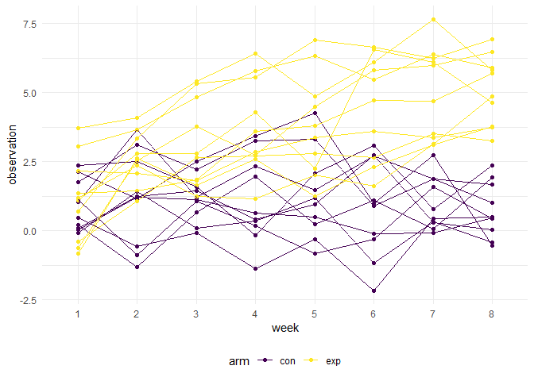

p8105\_hw5\_jz3425
================

## Problem 1

``` r
homicide = 
  read_csv("https://raw.githubusercontent.com/washingtonpost/data-homicides/master/homicide-data.csv")
```

Discription: The raw data contains 52179 cases of homicide in 50 large
U.S. cities over the past decades.There are 12 variables including
victim’s name, location and time of the killing and whether an arrest
was made.

Summarize within cities to obtain the total number of homicides and the
number of unsolved homicides:

``` r
homicide_df = 
  homicide %>% 
  unite("city_state", city:state)

homicide_total = 
  homicide_df %>% 
  group_by(city_state) %>% 
  summarize(total_number = n())

homicide_unsolved =
  homicide_df %>% 
  filter(disposition %in% c("Closed without arrest", "Open/No arrest")) %>% 
  group_by(city_state) %>% 
  summarize(unsolved_number = n())

homicide_summarize =
  left_join(homicide_total, homicide_unsolved, by = "city_state") %>% 
  mutate(unsolved_number = replace_na(unsolved_number, 0))
 
homicide_summarize %>% knitr::kable()
```

| city\_state        | total\_number | unsolved\_number |
|:-------------------|--------------:|-----------------:|
| Albuquerque\_NM    |           378 |              146 |
| Atlanta\_GA        |           973 |              373 |
| Baltimore\_MD      |          2827 |             1825 |
| Baton Rouge\_LA    |           424 |              196 |
| Birmingham\_AL     |           800 |              347 |
| Boston\_MA         |           614 |              310 |
| Buffalo\_NY        |           521 |              319 |
| Charlotte\_NC      |           687 |              206 |
| Chicago\_IL        |          5535 |             4073 |
| Cincinnati\_OH     |           694 |              309 |
| Columbus\_OH       |          1084 |              575 |
| Dallas\_TX         |          1567 |              754 |
| Denver\_CO         |           312 |              169 |
| Detroit\_MI        |          2519 |             1482 |
| Durham\_NC         |           276 |              101 |
| Fort Worth\_TX     |           549 |              255 |
| Fresno\_CA         |           487 |              169 |
| Houston\_TX        |          2942 |             1493 |
| Indianapolis\_IN   |          1322 |              594 |
| Jacksonville\_FL   |          1168 |              597 |
| Kansas City\_MO    |          1190 |              486 |
| Las Vegas\_NV      |          1381 |              572 |
| Long Beach\_CA     |           378 |              156 |
| Los Angeles\_CA    |          2257 |             1106 |
| Louisville\_KY     |           576 |              261 |
| Memphis\_TN        |          1514 |              483 |
| Miami\_FL          |           744 |              450 |
| Milwaukee\_wI      |          1115 |              403 |
| Minneapolis\_MN    |           366 |              187 |
| Nashville\_TN      |           767 |              278 |
| New Orleans\_LA    |          1434 |              930 |
| New York\_NY       |           627 |              243 |
| Oakland\_CA        |           947 |              508 |
| Oklahoma City\_OK  |           672 |              326 |
| Omaha\_NE          |           409 |              169 |
| Philadelphia\_PA   |          3037 |             1360 |
| Phoenix\_AZ        |           914 |              504 |
| Pittsburgh\_PA     |           631 |              337 |
| Richmond\_VA       |           429 |              113 |
| Sacramento\_CA     |           376 |              139 |
| San Antonio\_TX    |           833 |              357 |
| San Bernardino\_CA |           275 |              170 |
| San Diego\_CA      |           461 |              175 |
| San Francisco\_CA  |           663 |              336 |
| Savannah\_GA       |           246 |              115 |
| St. Louis\_MO      |          1677 |              905 |
| Stockton\_CA       |           444 |              266 |
| Tampa\_FL          |           208 |               95 |
| Tulsa\_AL          |             1 |                0 |
| Tulsa\_OK          |           583 |              193 |
| Washington\_DC     |          1345 |              589 |

prop.test for Baltimore:

``` r
prop_test_baltimore =
  prop.test(
    homicide_summarize %>% filter(city_state == "Baltimore_MD") %>% pull(unsolved_number),
    homicide_summarize %>% filter(city_state == "Baltimore_MD") %>% pull(total_number)
  )

prop_test_baltimore %>% 
  broom::tidy() %>% 
  select(estimate, conf.low, conf.high) %>% 
  janitor::clean_names() %>% 
  knitr::kable(digit = 3)
```

| estimate | conf\_low | conf\_high |
|---------:|----------:|-----------:|
|    0.646 |     0.628 |      0.663 |

run prop.test for each of the cities:

``` r
prop_test_df = 
  homicide_summarize %>% 
  mutate(
    prop_test = map2(.x = unsolved_number, .y = total_number, ~ prop.test(x = .x, n = .y)),
    prop_test = map(prop_test, broom::tidy)
  ) %>% 
  unnest() %>% 
  select(city_state, total_number, unsolved_number, estimate, conf.low, conf.high) %>% 
  janitor::clean_names()

prop_test_df %>% knitr::kable(digit = 3)
```

| city\_state        | total\_number | unsolved\_number | estimate | conf\_low | conf\_high |
|:-------------------|--------------:|-----------------:|---------:|----------:|-----------:|
| Albuquerque\_NM    |           378 |              146 |    0.386 |     0.337 |      0.438 |
| Atlanta\_GA        |           973 |              373 |    0.383 |     0.353 |      0.415 |
| Baltimore\_MD      |          2827 |             1825 |    0.646 |     0.628 |      0.663 |
| Baton Rouge\_LA    |           424 |              196 |    0.462 |     0.414 |      0.511 |
| Birmingham\_AL     |           800 |              347 |    0.434 |     0.399 |      0.469 |
| Boston\_MA         |           614 |              310 |    0.505 |     0.465 |      0.545 |
| Buffalo\_NY        |           521 |              319 |    0.612 |     0.569 |      0.654 |
| Charlotte\_NC      |           687 |              206 |    0.300 |     0.266 |      0.336 |
| Chicago\_IL        |          5535 |             4073 |    0.736 |     0.724 |      0.747 |
| Cincinnati\_OH     |           694 |              309 |    0.445 |     0.408 |      0.483 |
| Columbus\_OH       |          1084 |              575 |    0.530 |     0.500 |      0.560 |
| Dallas\_TX         |          1567 |              754 |    0.481 |     0.456 |      0.506 |
| Denver\_CO         |           312 |              169 |    0.542 |     0.485 |      0.598 |
| Detroit\_MI        |          2519 |             1482 |    0.588 |     0.569 |      0.608 |
| Durham\_NC         |           276 |              101 |    0.366 |     0.310 |      0.426 |
| Fort Worth\_TX     |           549 |              255 |    0.464 |     0.422 |      0.507 |
| Fresno\_CA         |           487 |              169 |    0.347 |     0.305 |      0.391 |
| Houston\_TX        |          2942 |             1493 |    0.507 |     0.489 |      0.526 |
| Indianapolis\_IN   |          1322 |              594 |    0.449 |     0.422 |      0.477 |
| Jacksonville\_FL   |          1168 |              597 |    0.511 |     0.482 |      0.540 |
| Kansas City\_MO    |          1190 |              486 |    0.408 |     0.380 |      0.437 |
| Las Vegas\_NV      |          1381 |              572 |    0.414 |     0.388 |      0.441 |
| Long Beach\_CA     |           378 |              156 |    0.413 |     0.363 |      0.464 |
| Los Angeles\_CA    |          2257 |             1106 |    0.490 |     0.469 |      0.511 |
| Louisville\_KY     |           576 |              261 |    0.453 |     0.412 |      0.495 |
| Memphis\_TN        |          1514 |              483 |    0.319 |     0.296 |      0.343 |
| Miami\_FL          |           744 |              450 |    0.605 |     0.569 |      0.640 |
| Milwaukee\_wI      |          1115 |              403 |    0.361 |     0.333 |      0.391 |
| Minneapolis\_MN    |           366 |              187 |    0.511 |     0.459 |      0.563 |
| Nashville\_TN      |           767 |              278 |    0.362 |     0.329 |      0.398 |
| New Orleans\_LA    |          1434 |              930 |    0.649 |     0.623 |      0.673 |
| New York\_NY       |           627 |              243 |    0.388 |     0.349 |      0.427 |
| Oakland\_CA        |           947 |              508 |    0.536 |     0.504 |      0.569 |
| Oklahoma City\_OK  |           672 |              326 |    0.485 |     0.447 |      0.524 |
| Omaha\_NE          |           409 |              169 |    0.413 |     0.365 |      0.463 |
| Philadelphia\_PA   |          3037 |             1360 |    0.448 |     0.430 |      0.466 |
| Phoenix\_AZ        |           914 |              504 |    0.551 |     0.518 |      0.584 |
| Pittsburgh\_PA     |           631 |              337 |    0.534 |     0.494 |      0.573 |
| Richmond\_VA       |           429 |              113 |    0.263 |     0.223 |      0.308 |
| Sacramento\_CA     |           376 |              139 |    0.370 |     0.321 |      0.421 |
| San Antonio\_TX    |           833 |              357 |    0.429 |     0.395 |      0.463 |
| San Bernardino\_CA |           275 |              170 |    0.618 |     0.558 |      0.675 |
| San Diego\_CA      |           461 |              175 |    0.380 |     0.335 |      0.426 |
| San Francisco\_CA  |           663 |              336 |    0.507 |     0.468 |      0.545 |
| Savannah\_GA       |           246 |              115 |    0.467 |     0.404 |      0.532 |
| St. Louis\_MO      |          1677 |              905 |    0.540 |     0.515 |      0.564 |
| Stockton\_CA       |           444 |              266 |    0.599 |     0.552 |      0.645 |
| Tampa\_FL          |           208 |               95 |    0.457 |     0.388 |      0.527 |
| Tulsa\_AL          |             1 |                0 |    0.000 |     0.000 |      0.945 |
| Tulsa\_OK          |           583 |              193 |    0.331 |     0.293 |      0.371 |
| Washington\_DC     |          1345 |              589 |    0.438 |     0.411 |      0.465 |

Create a plot that shows the estimates and CIs for each city:

``` r
prop_test_df %>% 
  mutate(
    city_state = fct_reorder(city_state, estimate)
  ) %>% 
  ggplot(aes(y = city_state, x = estimate, fill = city_state)) +
  geom_col() +
  geom_errorbar(aes(xmin = conf_low, xmax = conf_high)) +
  theme(legend.position = "none") +
  labs(
    title = "Estimated unsolved proportion plot",
    x = "estimated unsolved proportion",
    y = "city"
  )
```

<!-- -->

## Problem 2

Create a tidy dataframe containing data from all participants, including
the subject ID, arm, and observations over time:

``` r
list_files = list.files("data", full.names = TRUE)

df = 
  map(list_files, read_csv) %>% 
  bind_rows()

df =
  df %>% 
  mutate(
    name = list.files("data"),
    name = substr(name, 1, 6)
    ) %>% 
  separate(name, into = c("arm", "id"), sep = "_") %>% 
  mutate(
    id = as.numeric(id)
  ) %>% 
  select(id, arm, everything()) %>% 
  pivot_longer(
    week_1:week_8,
    names_to = "week",
    names_prefix = "week_",
    values_to = "observation"
  )

df
```

    ## # A tibble: 160 x 4
    ##       id arm   week  observation
    ##    <dbl> <chr> <chr>       <dbl>
    ##  1     1 con   1            0.2 
    ##  2     1 con   2           -1.31
    ##  3     1 con   3            0.66
    ##  4     1 con   4            1.96
    ##  5     1 con   5            0.23
    ##  6     1 con   6            1.09
    ##  7     1 con   7            0.05
    ##  8     1 con   8            1.94
    ##  9     2 con   1            1.13
    ## 10     2 con   2           -0.88
    ## # ... with 150 more rows

Make a spaghetti plot showing observations on each subject over time:

``` r
df %>% 
  mutate(id = factor(id)) %>% 
  ggplot(aes(x = week, y = observation, color = arm)) +
  geom_point() +
  geom_line(aes(group = interaction(id, arm)))
```

<!-- -->

Apparently, observations of experimental groups are higher than those of
control groups. In general, observations of experimental groups have a
increasing trend over weeks, while control groups seem relatively
steady.

## Problem 3

``` r
set.seed(10)

iris_with_missing = iris %>% 
  map_df(~replace(.x, sample(1:150, 20), NA)) %>%
  mutate(Species = as.character(Species)) %>% 
  janitor::clean_names()

fill_in = function(x) {
  
  if (is.numeric(x)) {
    mean = mean(x, na.rm = TRUE)
    x = replace_na(x, mean)
  } else {
    x = replace_na(x, "virginica")
  }
  
  x
  
}

iris_fill = map_dfr(iris_with_missing, fill_in)

iris_fill %>% knitr::kable(digit = 1)
```

| sepal\_length | sepal\_width | petal\_length | petal\_width | species    |
|--------------:|-------------:|--------------:|-------------:|:-----------|
|           5.1 |          3.5 |           1.4 |          0.2 | setosa     |
|           4.9 |          3.0 |           1.4 |          0.2 | setosa     |
|           4.7 |          3.2 |           1.3 |          0.2 | setosa     |
|           4.6 |          3.1 |           1.5 |          1.2 | setosa     |
|           5.0 |          3.6 |           1.4 |          0.2 | setosa     |
|           5.4 |          3.9 |           1.7 |          0.4 | setosa     |
|           5.8 |          3.4 |           1.4 |          0.3 | setosa     |
|           5.0 |          3.4 |           1.5 |          0.2 | setosa     |
|           4.4 |          2.9 |           1.4 |          0.2 | setosa     |
|           4.9 |          3.1 |           3.8 |          0.1 | setosa     |
|           5.4 |          3.1 |           1.5 |          0.2 | setosa     |
|           4.8 |          3.4 |           1.6 |          0.2 | setosa     |
|           5.8 |          3.1 |           1.4 |          0.1 | setosa     |
|           4.3 |          3.0 |           3.8 |          0.1 | setosa     |
|           5.8 |          4.0 |           3.8 |          0.2 | setosa     |
|           5.7 |          4.4 |           1.5 |          0.4 | setosa     |
|           5.4 |          3.9 |           1.3 |          0.4 | setosa     |
|           5.1 |          3.5 |           1.4 |          1.2 | setosa     |
|           5.7 |          3.8 |           1.7 |          0.3 | setosa     |
|           5.1 |          3.8 |           1.5 |          1.2 | setosa     |
|           5.4 |          3.4 |           1.7 |          0.2 | setosa     |
|           5.1 |          3.7 |           1.5 |          0.4 | virginica  |
|           4.6 |          3.6 |           1.0 |          0.2 | setosa     |
|           5.8 |          3.3 |           3.8 |          0.5 | setosa     |
|           4.8 |          3.4 |           1.9 |          0.2 | virginica  |
|           5.0 |          3.0 |           3.8 |          0.2 | setosa     |
|           5.0 |          3.4 |           1.6 |          0.4 | virginica  |
|           5.2 |          3.5 |           1.5 |          0.2 | setosa     |
|           5.8 |          3.4 |           1.4 |          0.2 | setosa     |
|           4.7 |          3.2 |           1.6 |          0.2 | setosa     |
|           4.8 |          3.1 |           3.8 |          0.2 | setosa     |
|           5.4 |          3.1 |           1.5 |          0.4 | setosa     |
|           5.2 |          3.1 |           1.5 |          0.1 | setosa     |
|           5.5 |          4.2 |           1.4 |          0.2 | setosa     |
|           4.9 |          3.1 |           3.8 |          0.2 | setosa     |
|           5.0 |          3.2 |           1.2 |          0.2 | setosa     |
|           5.5 |          3.5 |           1.3 |          0.2 | setosa     |
|           4.9 |          3.6 |           1.4 |          0.1 | setosa     |
|           4.4 |          3.0 |           1.3 |          1.2 | setosa     |
|           5.1 |          3.4 |           1.5 |          0.2 | setosa     |
|           5.0 |          3.5 |           1.3 |          0.3 | setosa     |
|           4.5 |          3.1 |           1.3 |          1.2 | virginica  |
|           4.4 |          3.2 |           1.3 |          0.2 | setosa     |
|           5.0 |          3.5 |           1.6 |          0.6 | setosa     |
|           5.1 |          3.8 |           1.9 |          0.4 | setosa     |
|           4.8 |          3.0 |           1.4 |          0.3 | virginica  |
|           5.1 |          3.8 |           1.6 |          0.2 | setosa     |
|           4.6 |          3.2 |           3.8 |          0.2 | setosa     |
|           5.3 |          3.7 |           1.5 |          0.2 | setosa     |
|           5.0 |          3.1 |           1.4 |          0.2 | setosa     |
|           7.0 |          3.1 |           4.7 |          1.4 | virginica  |
|           6.4 |          3.2 |           4.5 |          1.5 | versicolor |
|           6.9 |          3.1 |           4.9 |          1.5 | versicolor |
|           5.5 |          2.3 |           4.0 |          1.3 | versicolor |
|           6.5 |          2.8 |           4.6 |          1.5 | versicolor |
|           5.7 |          2.8 |           4.5 |          1.3 | versicolor |
|           6.3 |          3.3 |           4.7 |          1.6 | virginica  |
|           4.9 |          2.4 |           3.8 |          1.0 | versicolor |
|           6.6 |          2.9 |           4.6 |          1.3 | virginica  |
|           5.2 |          2.7 |           3.9 |          1.4 | versicolor |
|           5.0 |          2.0 |           3.8 |          1.0 | versicolor |
|           5.9 |          3.0 |           4.2 |          1.5 | versicolor |
|           6.0 |          2.2 |           4.0 |          1.2 | versicolor |
|           6.1 |          2.9 |           4.7 |          1.4 | versicolor |
|           5.6 |          2.9 |           3.6 |          1.3 | versicolor |
|           6.7 |          3.1 |           4.4 |          1.4 | versicolor |
|           5.6 |          3.0 |           4.5 |          1.5 | versicolor |
|           5.8 |          3.1 |           4.1 |          1.0 | versicolor |
|           6.2 |          2.2 |           4.5 |          1.5 | versicolor |
|           5.6 |          2.5 |           3.9 |          1.1 | versicolor |
|           5.9 |          3.2 |           4.8 |          1.8 | versicolor |
|           5.8 |          2.8 |           4.0 |          1.3 | virginica  |
|           6.3 |          2.5 |           4.9 |          1.5 | versicolor |
|           5.8 |          2.8 |           3.8 |          1.2 | versicolor |
|           6.4 |          2.9 |           4.3 |          1.3 | versicolor |
|           6.6 |          3.0 |           4.4 |          1.4 | versicolor |
|           6.8 |          2.8 |           4.8 |          1.4 | versicolor |
|           6.7 |          3.1 |           5.0 |          1.2 | versicolor |
|           6.0 |          3.1 |           4.5 |          1.2 | versicolor |
|           5.7 |          2.6 |           3.5 |          1.0 | virginica  |
|           5.5 |          2.4 |           3.8 |          1.1 | versicolor |
|           5.8 |          2.4 |           3.7 |          1.0 | versicolor |
|           5.8 |          2.7 |           3.9 |          1.2 | versicolor |
|           6.0 |          2.7 |           5.1 |          1.6 | versicolor |
|           5.4 |          3.0 |           4.5 |          1.5 | versicolor |
|           5.8 |          3.4 |           4.5 |          1.6 | versicolor |
|           6.7 |          3.1 |           4.7 |          1.2 | versicolor |
|           5.8 |          3.1 |           4.4 |          1.3 | versicolor |
|           5.6 |          3.0 |           3.8 |          1.2 | versicolor |
|           5.5 |          2.5 |           4.0 |          1.2 | versicolor |
|           5.5 |          3.1 |           4.4 |          1.2 | versicolor |
|           5.8 |          3.1 |           4.6 |          1.2 | versicolor |
|           5.8 |          3.1 |           4.0 |          1.2 | versicolor |
|           5.0 |          2.3 |           3.3 |          1.2 | virginica  |
|           5.8 |          2.7 |           4.2 |          1.3 | versicolor |
|           5.7 |          3.0 |           4.2 |          1.2 | versicolor |
|           5.7 |          2.9 |           4.2 |          1.3 | versicolor |
|           6.2 |          2.9 |           4.3 |          1.3 | versicolor |
|           5.1 |          2.5 |           3.0 |          1.2 | versicolor |
|           5.7 |          2.8 |           4.1 |          1.3 | virginica  |
|           6.3 |          3.1 |           3.8 |          2.5 | virginica  |
|           5.8 |          2.7 |           5.1 |          1.9 | virginica  |
|           7.1 |          3.0 |           5.9 |          2.1 | virginica  |
|           6.3 |          2.9 |           5.6 |          1.8 | virginica  |
|           6.5 |          3.1 |           5.8 |          2.2 | virginica  |
|           7.6 |          3.0 |           6.6 |          2.1 | virginica  |
|           4.9 |          2.5 |           4.5 |          1.7 | virginica  |
|           7.3 |          2.9 |           6.3 |          1.8 | virginica  |
|           6.7 |          3.1 |           3.8 |          1.8 | virginica  |
|           5.8 |          3.6 |           3.8 |          2.5 | virginica  |
|           6.5 |          3.2 |           5.1 |          2.0 | virginica  |
|           5.8 |          2.7 |           5.3 |          1.9 | virginica  |
|           6.8 |          3.0 |           5.5 |          2.1 | virginica  |
|           5.7 |          3.1 |           5.0 |          2.0 | virginica  |
|           5.8 |          2.8 |           5.1 |          2.4 | virginica  |
|           6.4 |          3.2 |           5.3 |          2.3 | virginica  |
|           6.5 |          3.0 |           3.8 |          1.8 | virginica  |
|           7.7 |          3.8 |           6.7 |          1.2 | virginica  |
|           7.7 |          2.6 |           6.9 |          2.3 | virginica  |
|           6.0 |          2.2 |           5.0 |          1.5 | virginica  |
|           5.8 |          3.2 |           5.7 |          1.2 | virginica  |
|           5.6 |          3.1 |           4.9 |          2.0 | virginica  |
|           7.7 |          2.8 |           6.7 |          2.0 | virginica  |
|           6.3 |          2.7 |           4.9 |          1.8 | virginica  |
|           6.7 |          3.3 |           5.7 |          2.1 | virginica  |
|           7.2 |          3.2 |           6.0 |          1.8 | virginica  |
|           6.2 |          2.8 |           4.8 |          1.8 | virginica  |
|           6.1 |          3.0 |           4.9 |          1.8 | virginica  |
|           6.4 |          2.8 |           5.6 |          2.1 | virginica  |
|           7.2 |          3.0 |           5.8 |          1.6 | virginica  |
|           7.4 |          2.8 |           6.1 |          1.2 | virginica  |
|           7.9 |          3.8 |           3.8 |          2.0 | virginica  |
|           6.4 |          2.8 |           3.8 |          2.2 | virginica  |
|           5.8 |          2.8 |           5.1 |          1.5 | virginica  |
|           6.1 |          3.1 |           5.6 |          1.4 | virginica  |
|           5.8 |          3.0 |           6.1 |          2.3 | virginica  |
|           5.8 |          3.4 |           5.6 |          1.2 | virginica  |
|           6.4 |          3.1 |           5.5 |          1.2 | virginica  |
|           6.0 |          3.0 |           4.8 |          1.8 | virginica  |
|           6.9 |          3.1 |           5.4 |          2.1 | virginica  |
|           6.7 |          3.1 |           5.6 |          2.4 | virginica  |
|           6.9 |          3.1 |           5.1 |          2.3 | virginica  |
|           5.8 |          2.7 |           5.1 |          1.9 | virginica  |
|           6.8 |          3.2 |           3.8 |          2.3 | virginica  |
|           6.7 |          3.3 |           3.8 |          2.5 | virginica  |
|           6.7 |          3.0 |           5.2 |          2.3 | virginica  |
|           6.3 |          2.5 |           5.0 |          1.9 | virginica  |
|           6.5 |          3.0 |           5.2 |          2.0 | virginica  |
|           5.8 |          3.4 |           5.4 |          2.3 | virginica  |
|           5.9 |          3.0 |           5.1 |          1.8 | virginica  |
